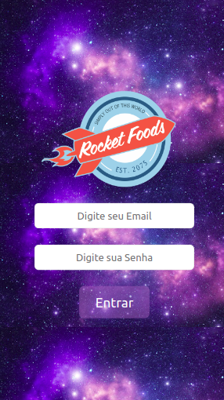
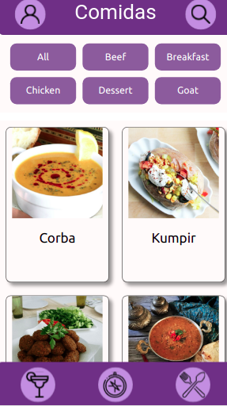
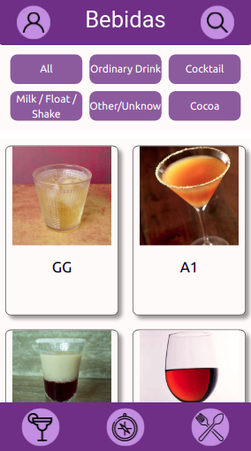
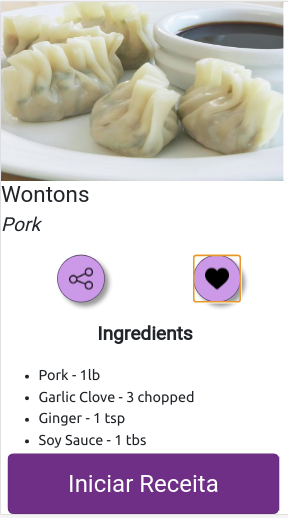
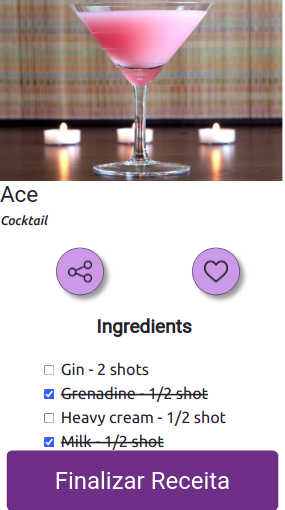

# Projeto App de Receitas!


### Tecnologias usadas:

* React
* Css
* Context API do React para gerenciar estado
* React Hook: useState, useContext e useEffect.


### O que foi desenvolvido.

Um app de receitas, utilizando o que há de mais moderno dentro do ecossistema React: Hooks e Context API!

Nele é possível ver, buscar, filtrar, favoritar e acompanhar o processo de preparação de receitas e drinks!

As bases de dados foram 2 APIs distintas, uma para comidas e outra para bebidas.

  * Api de comidas: [TheMealDB](https://www.themealdb.com/)

  * Api de bebidas: [TheCocktailDB](https://www.thecocktaildb.com/api.php)

O layout foi desenvolvido para dispositivos móveis.

### Baixando e rodando o aplicativo.

#### No seu terminal rode:

<h5>Clone o repositorio</h5>

```
git clone git@github.com:Melissa-gomes/App-de-receitas.git
```

<h5>Entre no diretorio do aplicativo</h5>

```
cd aplicativoDeReceitas
```

<h5>Instale todas as dependencias</h5>

```
npm install 
```

<h5>Rode o aplicativo React</h5>

```
npm start
```

O aplicativo será rodado na porta *localhost:3000*

<h5>Pronto agora é só usar e testar todas as funcionalidades do aplicativo 🚀</h5>


### Um pouco do layout que irá encontrar no aplicativo.


<br>
<br>


<br>
<br>


<br>
<br>


<br>
<br>


<br>
<br>

<h4>Existem mais telas a explorar no aplicativo.</h4>
